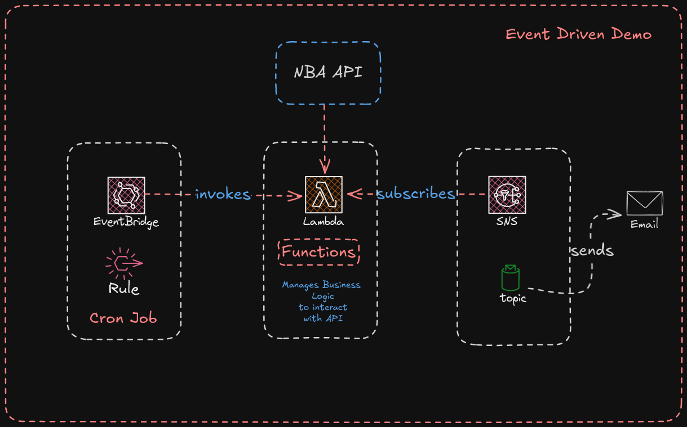
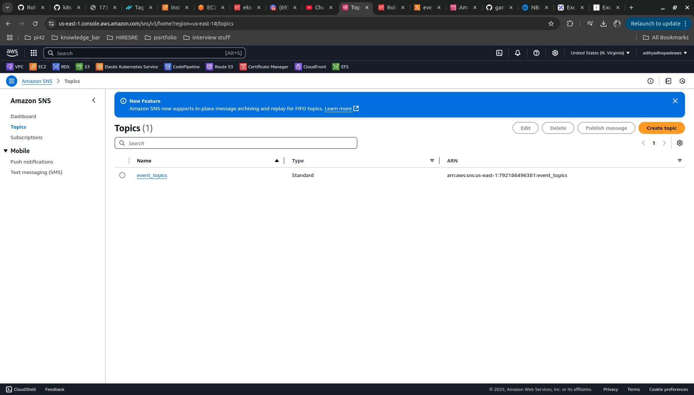
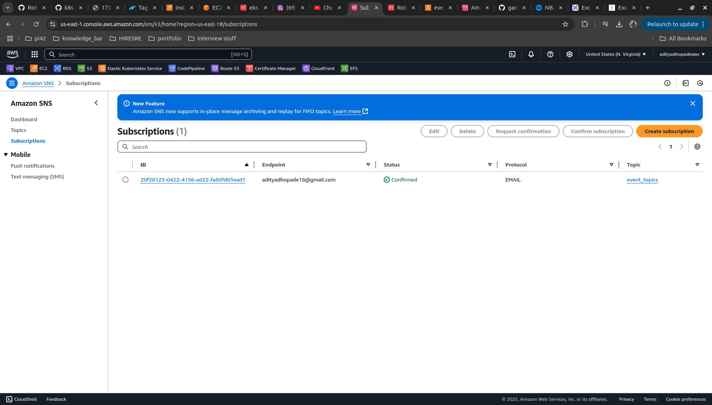
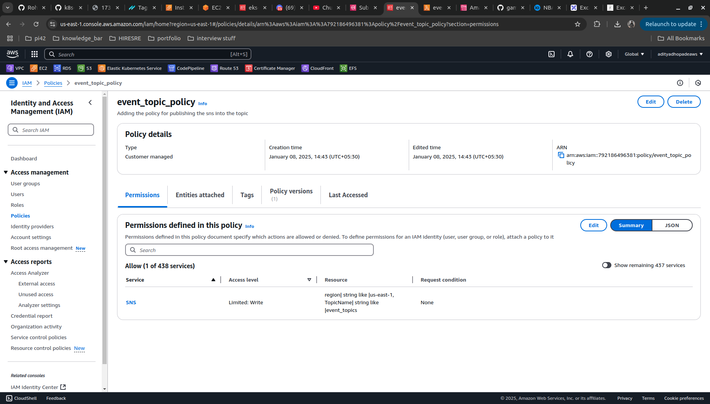
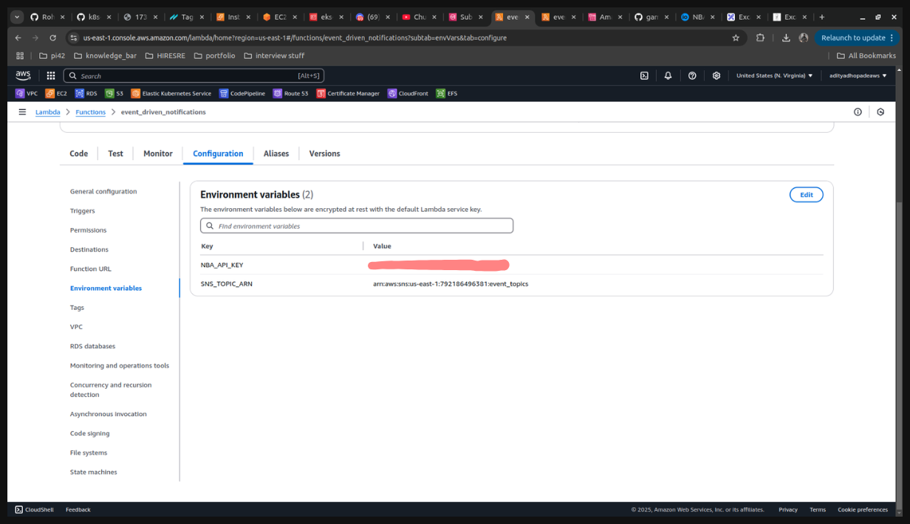
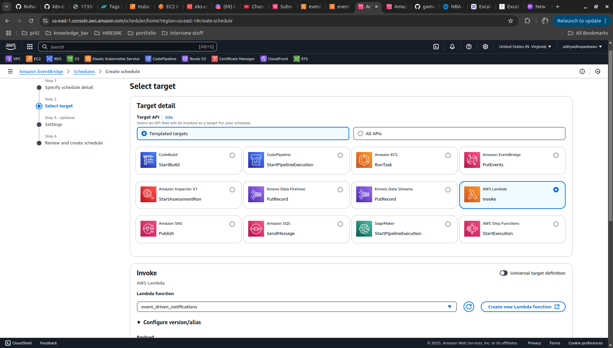

Here we are going to follow the setup for the Event Driven Architecture

#### AIM
: Is to send the Details of the NBA game to the user in a Email using Lambda, SNS Topics and to get the details at a particular point of time in the day using the Event Bridge.

#### TOOLS USED: 
```
AWS LAMBDA, 
AWS IAM, 
AWS SNS, 
AWS EVENT BRIDGE
``` 

#### Architecture:


#### Follow Along Steps:

**Step 1.** Create an AWS SNS Topic with the following details

```
Type: Standard
Topic Name: event_topic

# Hit Create the topic

```


**Step 2.** Create a Subscription to the AWS SNS Topic with the following details
```
Topic ARN : <Select ARN OF The event_topic>
Protocol: Select EMAIL <as we want tot sent email to the registered user>
Endpoint: <subscribers-email-id>

# Create the Subscription
```
**NOTE:** - WE need to confirm the subscription over the EMAIL ID's `after creation of the subscription.`



**Step 3.** Create an Custom Policy for SNS Topic in the IAM [For adding it to the Lambda Function]
```
IAM > POLICY > CREATE POLICY > Service: SNS

# Add the Custom JSON policy
{
    "Version": "2012-10-17",
    "Statement": [
        {
            "Effect": "Allow",
            "Action": "sns:Publish",
            "Resource": "<arn-of-topic-created>:event_topics"
        }
    ]
}

Name it as => event_topic_policy


```
Such policy will be created 


**Step 4.** Create a Role to Attach to Lambda; also attaching the `event_topic_policy` here.
```
# Create Role
Trusted entity type: AWS SERVICE
Usecase: Lambda

Permission Policies:
Add event_topic_policy
Add AWSLambdaBasicExecutionRole


# Add the Role name as `lamba_role_eventdriven`
```
**Step 5.** Create a Lambda Function `event_driven_notifications` and attaching role `lamba_role_eventdriven`

```
Create Function => Author it from scratch
Function Name => event_driven_notifications
Runtime => python 3.13

Change Default Execution Role => Use an Existing Role
Add Existing Role => lambda_role_eventdriven [From Dropdown]

# Create the function
```
- Now we needed to add the Python Code for getting the business logic for the Code
- Modify the Existing `lambda_function.py` and set it as follows
```
import os
import json
import urllib.request
import boto3
from datetime import datetime, timedelta, timezone

def format_game_data(game):
    status = game.get("Status", "Unknown")
    away_team = game.get("AwayTeam", "Unknown")
    home_team = game.get("HomeTeam", "Unknown")
    final_score = f"{game.get('AwayTeamScore', 'N/A')}-{game.get('HomeTeamScore', 'N/A')}"
    start_time = game.get("DateTime", "Unknown")
    channel = game.get("Channel", "Unknown")
    
    # Format quarters
    quarters = game.get("Quarters", [])
    quarter_scores = ', '.join([f"Q{q['Number']}: {q.get('AwayScore', 'N/A')}-{q.get('HomeScore', 'N/A')}" for q in quarters])
    
    if status == "Final":
        return (
            f"Game Status: {status}\n"
            f"{away_team} vs {home_team}\n"
            f"Final Score: {final_score}\n"
            f"Start Time: {start_time}\n"
            f"Channel: {channel}\n"
            f"Quarter Scores: {quarter_scores}\n"
        )
    elif status == "InProgress":
        last_play = game.get("LastPlay", "N/A")
        return (
            f"Game Status: {status}\n"
            f"{away_team} vs {home_team}\n"
            f"Current Score: {final_score}\n"
            f"Last Play: {last_play}\n"
            f"Channel: {channel}\n"
        )
    elif status == "Scheduled":
        return (
            f"Game Status: {status}\n"
            f"{away_team} vs {home_team}\n"
            f"Start Time: {start_time}\n"
            f"Channel: {channel}\n"
        )
    else:
        return (
            f"Game Status: {status}\n"
            f"{away_team} vs {home_team}\n"
            f"Details are unavailable at the moment.\n"
        )

def lambda_handler(event, context):
    # Get environment variables
    api_key = os.getenv("NBA_API_KEY")
    sns_topic_arn = os.getenv("SNS_TOPIC_ARN")
    sns_client = boto3.client("sns")
    
    # Adjust for Central Time (UTC-6)
    utc_now = datetime.now(timezone.utc)
    central_time = utc_now - timedelta(hours=6)  # Central Time is UTC-6
    today_date = central_time.strftime("%Y-%m-%d")
    
    print(f"Fetching games for date: {today_date}")
    
    # Fetch data from the API
    api_url = f"https://api.sportsdata.io/v3/nba/scores/json/GamesByDate/{today_date}?key={api_key}"
    print(today_date)
     
    try:
        with urllib.request.urlopen(api_url) as response:
            data = json.loads(response.read().decode())
            print(json.dumps(data, indent=4))  # Debugging: log the raw data
    except Exception as e:
        print(f"Error fetching data from API: {e}")
        return {"statusCode": 500, "body": "Error fetching data"}
    
    # Include all games (final, in-progress, and scheduled)
    messages = [format_game_data(game) for game in data]
    final_message = "\n---\n".join(messages) if messages else "No games available for today."
    
    # Publish to SNS
    try:
        sns_client.publish(
            TopicArn=sns_topic_arn,
            Message=final_message,
            Subject="NBA Game Updates"
        )
        print("Message published to SNS successfully.")
    except Exception as e:
        print(f"Error publishing to SNS: {e}")
        return {"statusCode": 500, "body": "Error publishing to SNS"}
    
    return {"statusCode": 200, "body": "Data processed and sent to SNS"}
```

#### Lets Decipher the Python Code here
Getting to know the `lambda_handler` Functions `[Entry Point to the Code]` used in the above commands are setted as follows. Inside the Lambda Handler Function
```

    # Need to get the API_KEY and SNS_TOPIC_ARN
    api_key = os.getenv("NBA_API_KEY")
    sns_topic_arn = os.getenv("SNS_TOPIC_ARN")
    sns_client = boto3.client("sns")
```

- To get the NBA_API_KEY create an account on `https://sportsdata.io/`; use api to get the Data from NBA; Also further add the details of the `ARN of SNS TOPIC`

 

- Here we are adjusting the time according to the `central time zone`. [For Demo Purposes]
 ```
 # Adjusting the time according to the central time zone
     # Adjust for Central Time (UTC-6)
    utc_now = datetime.now(timezone.utc)
    central_time = utc_now - timedelta(hours=6)  # Central Time is UTC-6
    today_date = central_time.strftime("%Y-%m-%d")
    
    print(f"Fetching games for date: {today_date}")
 ```

 - Fetching the Data from the API with the `API_KEY` setted in the `env` variables; if the data is avaialble then print the `json dump of games today` or if any other exception `throw 500 Error` fetching data

```
 # Fetch data from the API
    api_url = f"https://api.sportsdata.io/v3/nba/scores/json/GamesByDate/{today_date}?key={api_key}"
    print(today_date)
     
    try:
        with urllib.request.urlopen(api_url) as response:
            data = json.loads(response.read().decode())
            print(json.dumps(data, indent=4))  # Debugging: log the raw data
    except Exception as e:
        print(f"Error fetching data from API: {e}")
        return {"statusCode": 500, "body": "Error fetching data"}
```
- We have included all games here, which are either of `final`, `in-progress` or `scheduled`
- We are passing the games to the function `format_game_data` to show it properly to the end user from the JSON Dump that we have recieved.

```
# Include all games (final, in-progress, and scheduled)
    messages = [format_game_data(game) for game in data]

    # we are stacking the games here; if no games available "No games available for today."
    final_message = "\n---\n".join(messages) if messages else "No games available for today."
    
    # Publish to SNS with the following details
    try:
        sns_client.publish(
            # Subscribers Email
            TopicArn=sns_topic_arn,
            # Email Content
            Message=final_message,
            # Email Subject
            Subject="NBA Game Updates"
        )
        print("Message published to SNS successfully.")
    except Exception as e:
        print(f"Error publishing to SNS: {e}")
        return {"statusCode": 500, "body": "Error publishing to SNS"}
    # Retrun the Code to Lambda
    return {"statusCode": 200, "body": "Data processed and sent to SNS"}
```

- Now for the `format_game_data` we have the function setted as follows where we have the following setted as
```
def format_game_data(game):
    status = game.get("Status", "Unknown")
    away_team = game.get("AwayTeam", "Unknown")
    home_team = game.get("HomeTeam", "Unknown")
    final_score = f"{game.get('AwayTeamScore', 'N/A')}-{game.get('HomeTeamScore', 'N/A')}"
    start_time = game.get("DateTime", "Unknown")
    channel = game.get("Channel", "Unknown")
    
    # Format quarters
    quarters = game.get("Quarters", [])
    quarter_scores = ', '.join([f"Q{q['Number']}: {q.get('AwayScore', 'N/A')}-{q.get('HomeScore', 'N/A')}" for q in quarters])
    
    # If the game is final game then show the following details fror the game
    if status == "Final":
        return (
            f"Game Status: {status}\n"
            f"{away_team} vs {home_team}\n"
            f"Final Score: {final_score}\n"
            f"Start Time: {start_time}\n"
            f"Channel: {channel}\n"
            f"Quarter Scores: {quarter_scores}\n"
        )
    # if the game is in progress show the following game    
    elif status == "InProgress":
        last_play = game.get("LastPlay", "N/A")
        return (
            f"Game Status: {status}\n"
            f"{away_team} vs {home_team}\n"
            f"Current Score: {final_score}\n"
            f"Last Play: {last_play}\n"
            f"Channel: {channel}\n"
        )
    # if the game is schedule show the following fields    
    elif status == "Scheduled":
        return (
            f"Game Status: {status}\n"
            f"{away_team} vs {home_team}\n"
            f"Start Time: {start_time}\n"
            f"Channel: {channel}\n"
        )
    else:
    # else no details available today
        return (
            f"Game Status: {status}\n"
            f"{away_team} vs {home_team}\n"
            f"Details are unavailable at the moment.\n"
        )
```
- Test and Deploy the Changes here
```
# Steps for testing
go to Functions > `Test` tab > name: test1 > keep rest of details as it is > Click `Test` [Top Right Corner]  ==> Should Work fine by now
```

**Step 6.** Create a Event Bridge; to set `rules` to execute the lambda function at certain time

- Steps to Create Schedule , ad details are as follows
```
Schedule name: event-based-trigger-lambda

Schedule Pattern: Cron based Schedule

TimeZone: IST

CRON Expression: 0 22 ? * MON-FRI *
# Execute the CRON JOB at 10 pm IST On Weekdays ; Not on Weekends [Refer CHAT GPT Here]

Set Flexible Time Window: none

Target Detail: AWS LAMBDA
Select the Lambda Function: event_driven_notification

Permissions: Create a new Role for the Schedule
```


- Here the Event Bridge will run the topic at given `CRON Expression`.